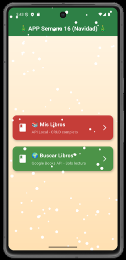
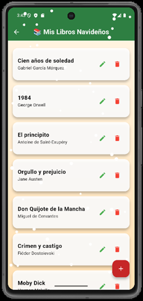
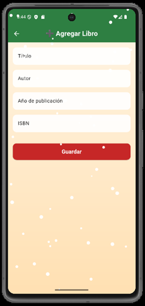
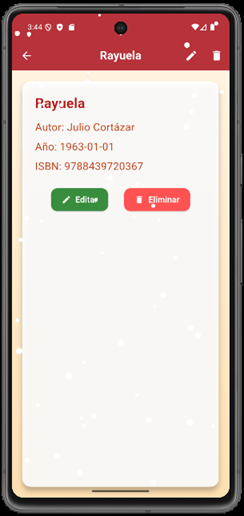
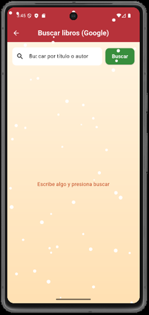
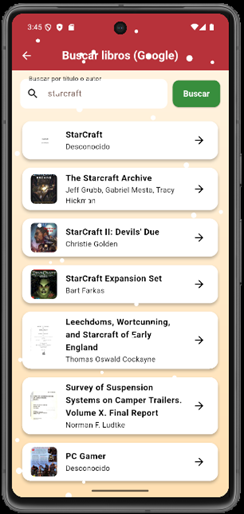

# 📱 App Libros - Flutter

`App Libros` es una aplicación móvil desarrollada con **Flutter** que permite gestionar y consultar libros desde dos fuentes:

1. **API Local**: CRUD completo usando Django REST API.  
2. **Google Books API**: Solo lectura para buscar y consultar libros por título o autor.

La app cuenta con una **interfaz navideña con animación de nieve**, diseñada para ofrecer una experiencia visual agradable y divertida.

---

## 🔹 Características

- Consultar libros de la **API local** (Agregar, Editar, Eliminar, Detalle).
- Buscar libros en **Google Books API**.
- Pantallas con diseño festivo (tema navideño).
- Animación de nieve en todas las pantallas.
- Validación de formularios para ingreso de datos.
- Notificaciones al usuario mediante `SnackBar` (operaciones exitosas o errores).

---

## 🔹 Estructura del proyecto

app_libros/
│
├── lib/
│ ├── main.dart ← Punto de entrada
│
│ ├── src/
│ │
│ │ ├── api/ ← Consumo de APIs
│ │ │ ├── api_local.dart ← CRUD (API Django)
│ │ │ └── api_google.dart ← Consulta (Google Books)
│ │
│ │ ├── models/ ← Modelos de datos
│ │ │ └── libro.dart
│ │
│ │ ├── screens/ ← Pantallas principales
│ │ │ ├── inicio.dart ← Menú de selección de API
│ │ │ ├── local_list.dart ← Lista libros API local
│ │ │ ├── local_form.dart ← Crear/Editar libro
│ │ │ ├── local_det.dart ← Detalle libro local
│ │ │ ├── google_list.dart ← Buscar libros Google
│ │ │ └── google_det.dart ← Detalle libro Google
│ │
│ │ ├── theme/ ← Tema global
│ │ │ └── app_theme.dart ← Colores y estilos
│ │
│ │ └── utils/ ← Constantes y utilidades
│ │ └── constantes.dart
│
├── pubspec.yaml ← Dependencias
└── README.md

---

## 🔹 Instalación y ejecución

1. **Clonar el repositorio:**

git clone https://github.com/Harryata/app_libros.git
cd app_libros

2. **Instalar dependencias:**

flutter pub get

3. **Ejecutar la app en un emulador o dispositivo:**

flutter run

> ⚠️ Asegúrate de tener la API local corriendo antes de usar la opción de CRUD.  
> La API local está disponible en el repositorio **[API Libros - Django](https://github.com/Harryata/lab016_flutter_api_django/tree/main)**.

---

## 🔹 Uso

### Pantalla de inicio

- **Mis Libros**: acceder a la API local (CRUD completo).  
- **Buscar Libros**: consultar Google Books API (solo lectura).

### API Local (Django)

- **Lista de libros**: muestra todos los libros agregados.
- **Agregar libro**: formulario con validación de campos.
- **Editar libro**: permite modificar cualquier campo.
- **Eliminar libro**: confirma antes de eliminar.
- **Detalle de libro**: muestra toda la información de cada libro.

### Google Books API

- Buscar por título o autor.
- Listado con imagen de portada (si está disponible).
- Acceder a detalles de cada libro.

---

## 🔹 Capturas de pantalla
## 🔹 Capturas de pantalla

